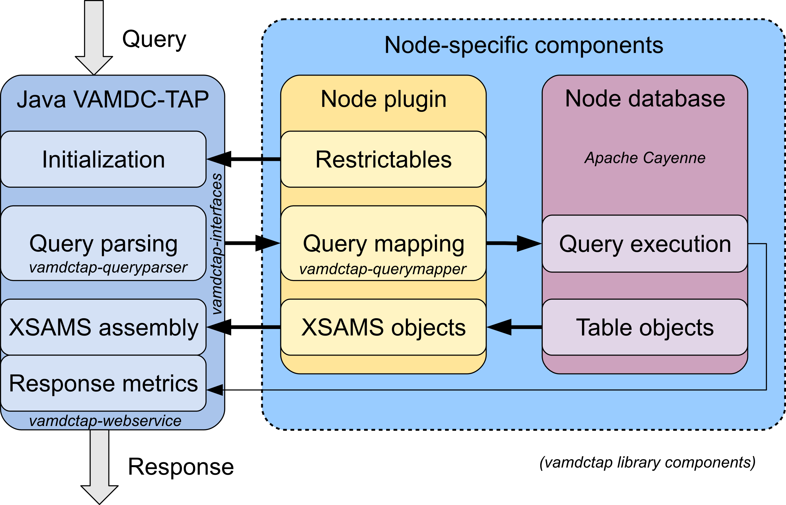

Database plugin
=========================

.. requestflow

Request processing
--------------------

In the course of normal operation, node software receives *HTTP GET* requests to the */TAP/sync* endpoint
and must respond to them with valid XSAMS documents. 

The following steps are performed to achieve that, Java VAMDC-TAP implementation (**Framework**)
is responsible for some of them.
Node **Plugin** is responsible for the others.
The Apache Cayenne object-relational mapping framework is used to access the **Database**.

*	On the query reception, **framework** asks the **plugin** for the list of supported **keywords**.

*	**Framework** is parsing the incoming query, checking it's validity and converting it 
	into a group of easily accessible :ref:`Query` objects.

*	**Framework** asks **Plugin** to construct the document by calling the :ref:`databasePlug` buildXSAMS() method.

*	**Plugin** maps the incoming query to one or more **Database** queries, 
	as described in the :ref:`QueryMap`.
	
*	Before executing or mapping the queries, **Plugin** *should* check 
	if the user actually requested the certain branch of XSAMS document to be built.
	See the :ref:`RequestInterface` checkBranch() method for the details.
	
*	**Plugin** receives objects from the **Database**, builds **XSAMS** branches from them and 
	gives those branches to the **Framework**. See the :ref:`XSAMSGen` section for the details.
	
*	When the document tree is built, **Plugin** returns the control to the **Framework**.

*	**Framework** does the final checks on the document tree, calculates accurate metrics for the document.

*	**Framework** converts the document tree into XML stream and sends it to the user.

Interaction between the database plugin and the Java node software is performed through two compact interfaces.

.. _DatabasePlug:

DatabasePlug interface
------------------------

Each and every node plugin must implement the **org.vamdc.tapservice.api.DatabasePlug** 
interface, defining the following methods:

*	*public abstract Collection<Restrictable> getRestrictables();*
	
	get restrictables supported by this node.
	Must return a collection of **org.vamdc.dictionary.Restrictable** dictionary elements.
	This method is called once per each request to the */TAP/sync* and */VOSI/capabilities* endpoints.
	
*	*public abstract void buildXSAMS (RequestInterface userRequest);*
	
	Build XSAMS document tree from the user request. 
	Object implementing **org.vamdc.tapservice.api.RequestInterface** :ref:`RequestInterface`
	is passed as a parameter. No return is expected.
	This method is called every time the node software is receiving a request to the */VOSI/capabilities* endpoint.
	
	**WARNING!** Node plugin object is instantiated only once when the node is started,
	all calls to buildXSAMS should be thread-safe to handle concurrent requests correctly.
	
	Implementation details are covered in the :ref:`XSAMSGen` section.
	
*	*public abstract Map<Dictionary.HeaderMetrics,Integer> getMetrics(RequestInterface userRequest);*
	
	Get query metrics. This method is called every time 
	the node receives the HEAD request to the */VOSI/capabilities* endpoint.
	*RequestInterface userRequest* parameter is identical to the one passed to buildXSAMS method.
	This method should return a map of VAMDC-COUNT-* HTTP header names and their estimate values.
	For the header names and meaning, see [VAMDC-TAP]_ documentation
	
	
*	*public abstract boolean isAvailable();*
	
	Do some really node-specific availability checks. This method is called
	periodically from the availability monitor. First call is initiated after the first request
	to the */VOSI/availability* service endpoint. Method may be used to temporary
	shutdown the node during the database maintenance, or to do some integrity checks on the database.
	Availability check interval may be set in the :ref:`config` option **selfcheck_interval**.
	
	**WARNING!** this method should not be used for doing periodic maintenance since it is never called before
	the first request to the */VOSI/availability* service endpoint.

	
.. _RequestInterface:

RequestInterface interface
-------------------------------

Calls to the node database plugin through :ref:`DatabasePlug` get as a parameter an object
implementing the **org.vamdc.tapservice.api.RequestInterface**, providing access to the request information and
node software facilities.

Following methods are part of that interface:

*	*public abstract boolean isValid();*
	this method returns **true** if the incoming request is valid and should be processed.
	
	In case of the **false** return, node plugin should not do any processing. Query string may be saved for logging
	purposes.

*	*public abstract Query getQuery();*
	This method returns the base object of the QueryParser library. Query interface is described
	in the :ref:`query` section of this document. A few shortcut methods are provided.
	
*	*public abstract LogicNode getRestrictsTree();*
	The shortcut method to get the logic tree of the incoming query.
	
*	*public abstract Collection<RestrictExpression> getRestricts();*
	The shortcut method to get all the keywords of the query, omitting the keywords relation logic.
	
	**WARNING!** This method should not be used as the main source of data for the query mapping since
	it completely looses the query relation logic. Imagine the query::
	
		SELECT ALL WHERE AtomSymbol='Ca' or AtomSymbol='Fe'
		
	If this method is used for the query mapping, this query would produce the same result as the query::
	
		SELECT ALL WHERE AtomSymbol='Ca' AND AtomSymbol='Fe' 
		
	which is obviously incorrect.
	
	
*	*public abstract String getQueryString();*
	The shortcut method to get the incoming query string.

*	*public abstract boolean checkBranch(Requestable branch);*
	The shortcut method for the Query.checkBranch(),
	returns true if the result document is requested to contain a certain branch of XSAMS,
	specified by the **org.vamdc.dictionary.Requestable** name.
	
	This method should be called in all builders to verify if a certain branch should be built,
	before even executing or mapping the queries.
	
	The behaviour of the keywords is described in the VAMDC Dictionary documentation [VAMDCDict]_, 
	the section **Requestables**
	
*	*public abstract ObjectContext getCayenneContext();*
	Get Apache Cayenne object context. That is the main endpoint of the Cayenne ORM library.
	For more information on using the Apache Cayenne look in the sections :ref:`datamodel` and :ref:`QueryMap`.

	
*	*public abstract XSAMSData getXsamsroot();*
	Get XSAMS tree manager, containing several helper methods.
	All XSAMS branches built by the node plugin should be attached to it.
	 
*	*public abstract Logger getLogger(Class<?> classname);*
	
	Get the **org.slf4j.Logger** object. All messages/errors reporting should be done with it.
	
	

