.. _datamodel:

Database Object Model
========================

Java VAMDC-TAP node software implementation suggests and supports the use of
Apache Cayenne Object-Relational Mapping (ORM) library.

Apache Cayenne supports various database engines, such as MySQL, PostgreSQL, SQLite, Oracle, DB2, Microsoft SQL Server.

Creation of database objects is made simple thanks to the graphical modeler application,
provided as a part of Cayenne.

Process of creating and using a database model is well described in the project official documentation [CAYDOC]_
and there is no need to repeat it in this document. Reading the Cayenne documentation is a **MUST** for the understanding
and creating efficient query mapper routines and high performance database access classes.

Step-by-step guide
----------------------

Here is a small illustrated guide on creating database mappings.
We will need Cayenne modeler application, it can be downloaded from 
http://cayenne.apache.org/download.html as a part of binary distribution.

Version 3.1 is recommended for use with the 12.07r2 version of the Java VAMDC-TAP Node Software.

Create maven project
+++++++++++++++++++++++

First we need to generate a Maven project::

	mvn archetype:generate \
	  -DarchetypeGroupId=org.apache.maven.archetypes \
	  -DgroupId=org.vamdc.database \
	  -DartifactId=daoclasses
	  
and create folder src/main/resources
where we will put cayenne modeler files.

Maven pom.xml can be replaced with the following contents::

	<project xmlns="http://maven.apache.org/POM/4.0.0" 
		xmlns:xsi="http://www.w3.org/2001/XMLSchema-instance"
		xsi:schemaLocation="http://maven.apache.org/POM/4.0.0 
			http://maven.apache.org/xsd/maven-4.0.0.xsd">
		<modelVersion>4.0.0</modelVersion>
		<groupId>org.vamdc.databaseName</groupId>
		<artifactId>node_dao</artifactId>
		<version>12.07r2</version>
		<name>databaseName database objects</name>

		<parent>
			<groupId>org.vamdc.tap</groupId>
			<artifactId>cayenne_dao</artifactId>
			<version>12.07r2</version>
		</parent>
		
		<repositories>
			<repository>
				<id>vamdc repository</id>
				<name>VAMDC stuff for Maven</name>
				<url>http://nexus.vamdc.org/nexus/content/repositories/releases</url>
				<layout>default</layout>
			</repository>
		</repositories>
	</project>

Create Cayenne classes
+++++++++++++++++++++++

Let's open the cayenne modeler application and create a new project:

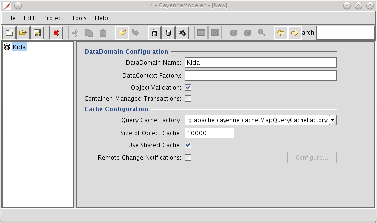

Now we need a dataNode describing the database connection

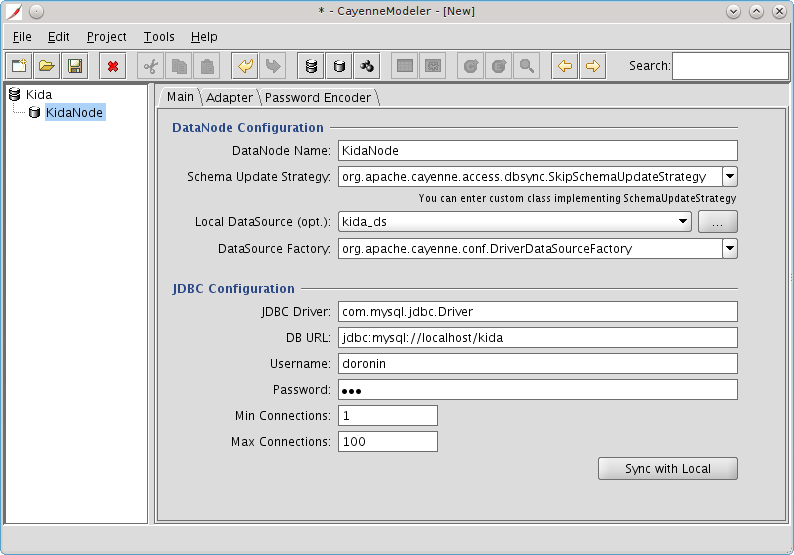

And a dataMap that will contain all mapping tables and classes

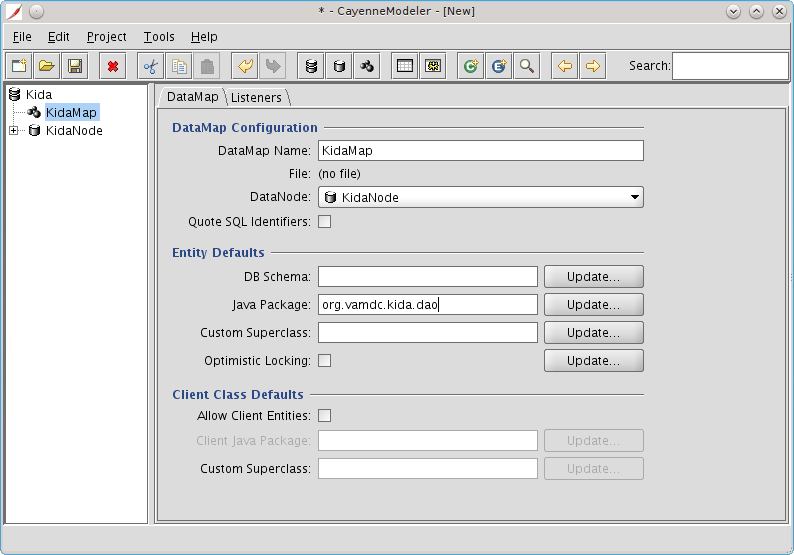

After the DataMap is created, we need to import the database schema:

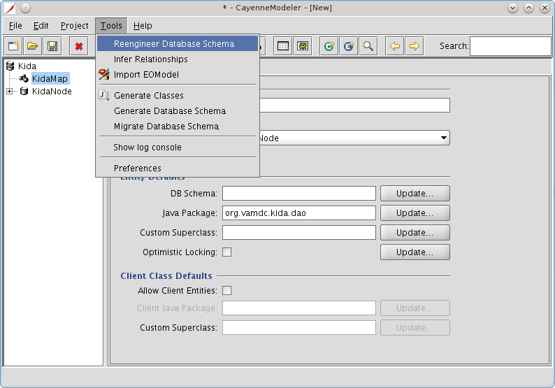

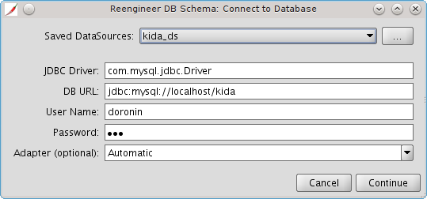

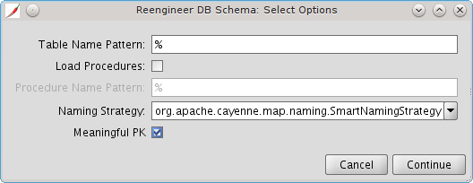

**!Note** the "Meaningful PK" flag is set to preserve the getter methods for the primary key fields.

As a result a separate Java class is generated for each database table table, 
containing attribute fields and relationship references.

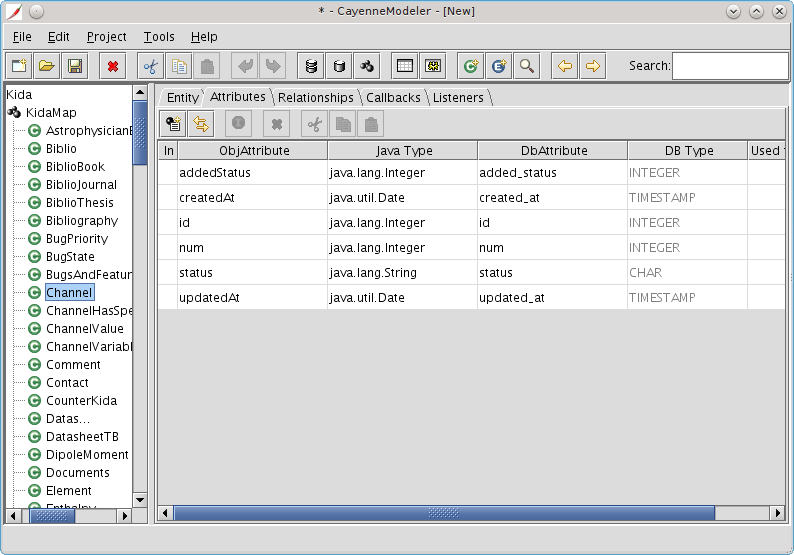

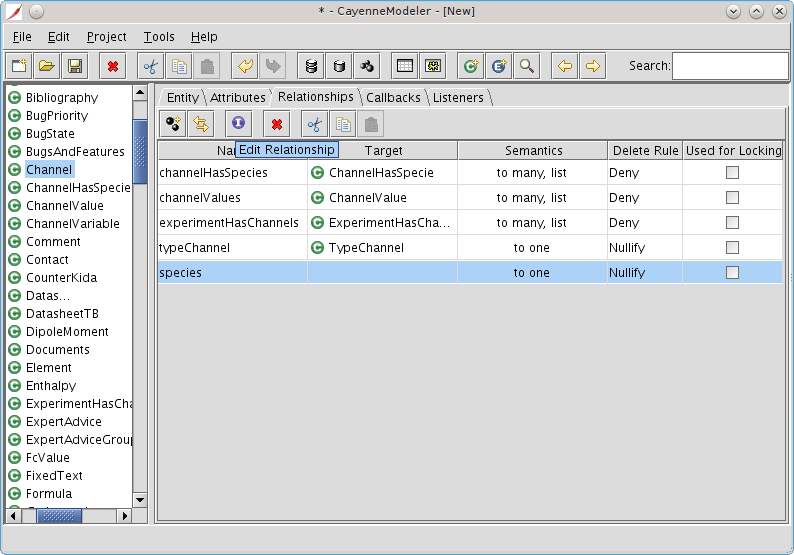

For many-to-many relations relationships need to be created manually:
create a new relationship, press on the violet I button, indicate the path in the bottom of the window.

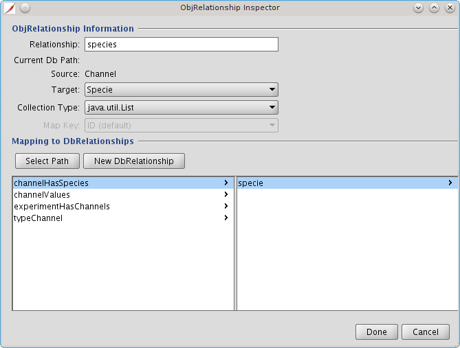

The last step is to generate class objects:

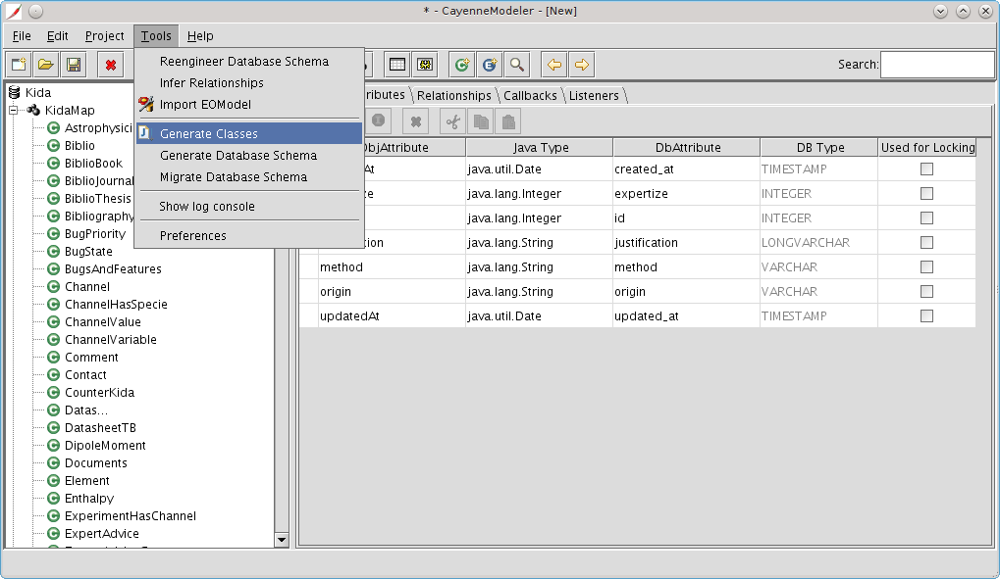

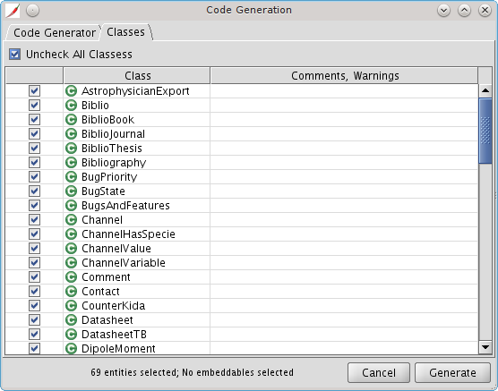

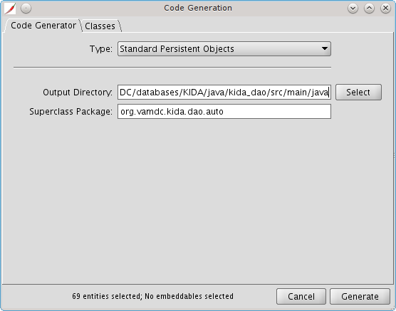

As a destination directory, src/main/java of Maven project needs to be specified.
Cayenne project itself needs to be saved next to it, in src/main/resources.

Notable Cayenne features used
-------------------------------

The use of an ORM framework provides several benefits:

*	Object-oriented view of the database;

*	Automatic relations traversal using the object methods 
	(explained below);

*	Simplified translation of the incoming queries (see :ref:`QueryHandling`)

Relations traversing
++++++++++++++++++++++

If properly defined, database model contains information about all table relations by means of the foreign keys.
While constructing the query, those relations can be automatically traversed to form the correct query with desired
selection criterias. 

As an example, let us have a look at the case of two tables, **'artists'** and **'albums'**, with a one-to-one mapping of albums to artists
using the foreign key **'albumArtist'** pointing to the **'id'** field of the **'artists'** table.

=== =================
 artists
---------------------
id   name
=== =================
1    Elton John
2    Michael Jackson
3    Joe Cocker
=== =================

and

=== ========== =========================== ======
albums
-------------------------------------------------
id   artistId   name                        year
=== ========== =========================== ======
1    1          The Big Picture             1997
2    1          Goodbye Yellow Brick Road   1973
3    2          Off the Wall                1979
4    2          Invincible                  2001
5    3          Across from Midnight        1997
6    3          Respect Yourself            2002
=== ========== =========================== ======

For the table **'albums'** we have one-to-one relation with the **'artists'** table, called **'albumArtist'**
and for artists the reverse one-to-many relationship **'artistAlbums'**

So, if we want to get all artists that released albums in 1997, we would create an **Expression** containing the path
from the **'artists'** table to the **'year'** field of **'albums'** table and the expression type **'match'**

::

	Expression exp = ExpressionFactory.matchExp("artistAlbums.year", 1997);
	SelectQuery query = new SelectQuery(Artists.class,exp);
	List<Artists> artists = context.performQuery(query);

To add another constraint on a query, we may redefine the Expression::

	exp = exp.andExp(ExpressionFactory.likeExp("name", "%Cocker%"));

Once we received the artists list, we may get the name of each artist, or have a look at all his albums::

	for (Artists artist:artists){
	  System.out.println("name: "+artist.Name+":");
	  for (Albums album:artist.getArtistAlbums()){
	    System.out.println("    Album: "+album.Name+"("+album.Year+")");
	  }
	}

This code should print something like::

	Elton John:
	    Album: The Big Picture(1997)
	    Album: Goodbye Yellow Brick Road(1973)
	Joe Cocker:
	    Album: Across from Midnight(1997)
	    Album: Respect Yourself(2002)

For the case of VAMDC node plugin, none of the expressions would require 'manual' construction: 
they will be translated from the incoming queries. Query translation is described in a separate chapter :ref:`queryMap`

Path aliases
+++++++++++++++

Imagine that we have the scenario of many-to-many relation through a separate table.
For the previous example, let's add a table **'albumartist'** with three columns, **'id'**, **'artistId'** and **'albumId'**
Table **'albums'** does not contain the 'artistID' column any more, but both forward and reverse relations are still 
called **'albumArtists'** and **'artistAlbums'**

Let us imagine that we need to select the artists that released their albums both in 1973 and 1997.

Joining expressions neither with exp.andExp nor exp.orExp would give us appropriate queries.

**exp.andExp()** would produce a query::

  SELECT DISTINCT t0.name, t0.id 
    FROM artist t0 
    JOIN albumartist t1 ON (t0.id = t1.idArtist) 
    JOIN album t2 ON (t1.idAlbum = t2.id) 
    WHERE (t2.year = 1973) AND (t2.year = 1997)

that obviously never returns the data since the WHERE sub-conditions are mutually exclusive.

**exp.orExp()** would produce a query::

  SELECT DISTINCT t0.name, t0.id 
    FROM artist t0 
    JOIN albumartist t1 ON (t0.id = t1.idArtist) 
    JOIN album t2 ON (t1.idAlbum = t2.id) 
    WHERE (t2.year = 1973) OR (t2.year = 1997)

that returns all the artists that released albums either in 1973 or 1997.

To resolve the problem, Apache Cayenne provides the aliases mechanism::

	Expression e1 = ExpressionFactory.match("artistAlbumsAlias1.year", 1997);
	Expression e2 = ExpressionFactory.match("artistAlbumsAlias2.year", 1973);
	Expression e = e1.andExp(e2);
	SelectQuery q = new SelectQuery(Artists.class, e);
	q.aliasPathSplits("artistAlbums", "artistAlbumsAlias1", "artistAlbumsAlias2");
	
That last command tells the select query how to interpret the alias. 
Because the aliases are different, the SQL generated will have two completely separate set of joins::

  SELECT DISTINCT t0.name, t0.id 
    FROM artist t0 
    JOIN albumartist t1 ON (t0.id = t1.idArtist) 
    JOIN album t2 ON (t1.idAlbum = t2.id) 
    JOIN albumartist t3 ON (t0.id = t3.idArtist) 
    JOIN album t4 ON (t3.idAlbum = t4.id) 
    WHERE (t2.year = 1997) AND (t4.year = 1973)

This is called "split path" in the Apache Cayenne terms.

If applied to the case of VAMDC databases, 
this approach may be used for handling the cases where the data is linked
through a separate join table, such as articles by author or year, or reactants in chemical reaction databases.

