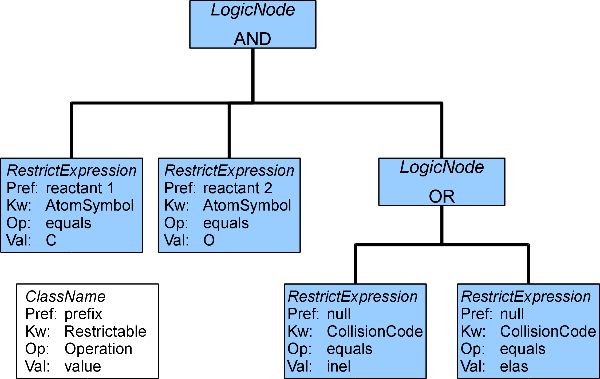

.. _QueryHandling:

VSS query recognition and mapping
=====================================

Obviously, each node has it's own database structure.
In order to fetch data requested by the NodeSoftware client,
incoming query needs to be mapped into one or multiple queries to the node database.
Java Node software tries to make the process of query mapping as simple and sophisticated as possible.

Query keywords tree
-----------------------

First, as Java node software receives a query, it validates it and parses into a tree of objects.
Intermediate nodes of that tree are representing boolean relations and leafs keep the information about
the query keywords, comparison operator and values.

For example, query::

	SELECT * WHERE reactant1.AtomSymbol = 'C' AND reactant2.AtomSymbol = 'O' 
	AND (CollisionCode='inel' or CollisionCode='elas')
	
would map into a tree

Tree objects
---------------------

Following objects are representing the query tree

.. _query:

Query
++++++++++++

Main interface of the query parser library,
provides access to the query tree and few utility methods.

*	**public LogicNode getRestrictsTree()**
	is the main method, returning the root of the query tree.

	Accompanying are two methods, **getFilteredTree** and **getPrefixedTree**, returning subsets of tree.

*	**public LogicNode getFilteredTree(Collection<Restrictable> allowedKeywords)**
	returns a subtree containing only keywords listed in collection passed as a parameter.

*	**public LogicNode getPrefixedTree(VSSPrefix prefix, int index)**
	returns a subtree containing only keywords having the defined prefix and index.
	If *null* is passed as a prefix, returned tree would only contain nodes without any prefix.
	
*	**public Collection<Prefix> getPrefixes()**
	returns a collection of prefixes present in the query

*	**public List<RestrictExpression> getRestrictsList()**
	is the most dummy method, returning a list of all keywords specified in the query.
	Using that list as a main source for query mapping is discourages since it leads to the loss of logic.
	

In **getFilteredTree()** and **getPrefixedTree()** the filtering algorithm removes the irrelevant RestrictExpression
objects from LogicNodes, then removes logicNodes that has no children.

For example, in case of filtering by the prefix:

*	Original query::

		select ALL where reactant1.AtomSymbol='C' and reactant1.AtomIonCharge=1 
		and reactant2.AtomSymbol='H' and reactant2.AtomIonCharge=-1 and temperature > 100

*	Effective query for getPrefixedTree(VSSPrefix.REACTANT, 1)::

		select ALL where reactant1.AtomSymbol='C' and reactant1.AtomIonCharge=1

*	Effective query for getPrefixedTree(VSSPrefix.REACTANT, 2)::

		select ALL where reactant2.AtomSymbol='H' and reactant2.AtomIonCharge=-1
	
*	Effective query for getPrefixedTree(null, 0)::

		select ALL where temperature > 100
	
*	Effective query for getFilteredTree() with a collection containing only AtomSymbol::

		select ALL where reactant1.AtomSymbol='C' and reactant2.AtomSymbol='H'

LogicNode
+++++++++++++++++

LogicNode interface represents a node of the query tree.
**getOperator()** method provides access to the node operator,
**getValues()** returns a collection of child nodes.

For certain operators like **NOT**, **getValue()** method also makes sense, returning a single
child element.

RestrictExpression
+++++++++++++++++++++

RestrictExpression elements are the leafs of the logic tree, representing the actual query restriction keywords.

Same as the LogicNode, RestrictExpression provides **getOperator()**, **getValues()** and **getValue()** methods,
plus

*	**public Prefix getPrefix()** method, returning this expression prefix

*	**public Restrictable getColumn()** method, returning a restriction keyword from the dictionary
	for this expression

Prefix
+++++++++++++

Prefix is a simple class, keeping **VSSPrefix** from the dictionary
and integer index of the prefix.

*	**int getIndex()** method provides access to index, and

*	**VSSPrefix getPrefix()** gives access to the prefix name.

.. _QueryMap:

Query mapping scenarios
-------------------------

To obtain an Apache Cayenne Expression object, several mapping scenarios are provided, plus plugin developer 
is free to implement his own one.

Mapping of logic tree
+++++++++++++++++++++++++

Mapping of logic tree nodes is always trivial and is one-to-one with 
Cayenne Expression.andExp(), Expression.orExp(), Expression.notExp(), see the Cayenne Javadoc [CAYJAVADOC]_

Usable example of such mapper is provided in *org.vamdc.tapservice.query.QueryMapper* class (CayenneUtil library),
that is bundled both with the TAPValidator and the node software.

Mapping of RestrictExpression elements
++++++++++++++++++++++++++++++++++++++++

Mapping of RestrictExpression elements may be a bit more tricky, since they contain lots of information:

*	prefix
*	prefix index
*	VAMDC dictionary keyword
*	comparison operator
*	value/value set

VAMDC keyword itself may map to one or more database columns,
for example, **MoleculeInchiKey** keyword, in case of a database that contains all species within one table,
says that the field is **InchiKey** and that we must verify that species we are looking at are actually molecules.
To correctly handle such a keyword we will need to AND two Cayenne Expressions and add them to the mapped tree.

Currently such multi-field mapping can be implemented only on the node-specific basis.
As an example of a simplier one-to-one mapping, the same *org.vamdc.tapservice.query.QueryMapper* class [QueryMapper]_ may be taken.

Prefix and prefix index may also require a check for a certain field, like if element 
is a reactant or product in chemical reaction.
In this case it may make sense to loop over all defined prefixes using **Query.getPrefixes()** method, then
filter the incoming query tree by the prefix with the **Query.getPrefixedTree(...)**, map it as usual,
add the desired logic to the resulting expression and finally AND the mapped filtered subtree to the resulting query.

