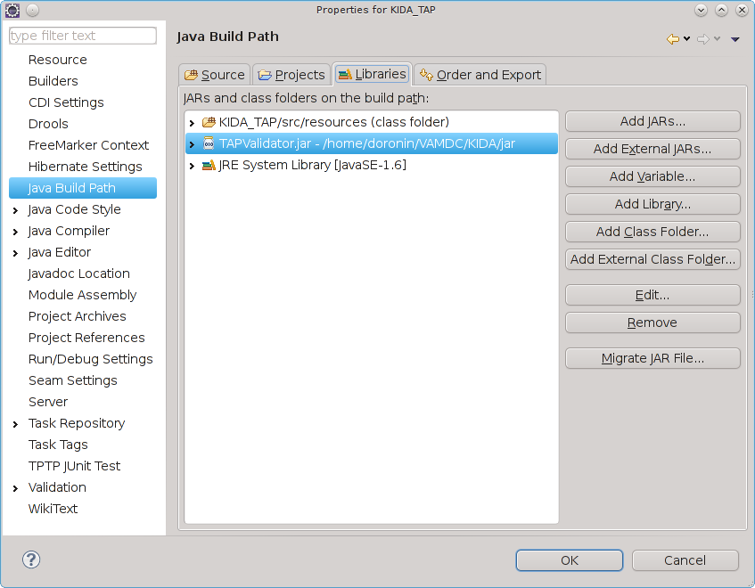
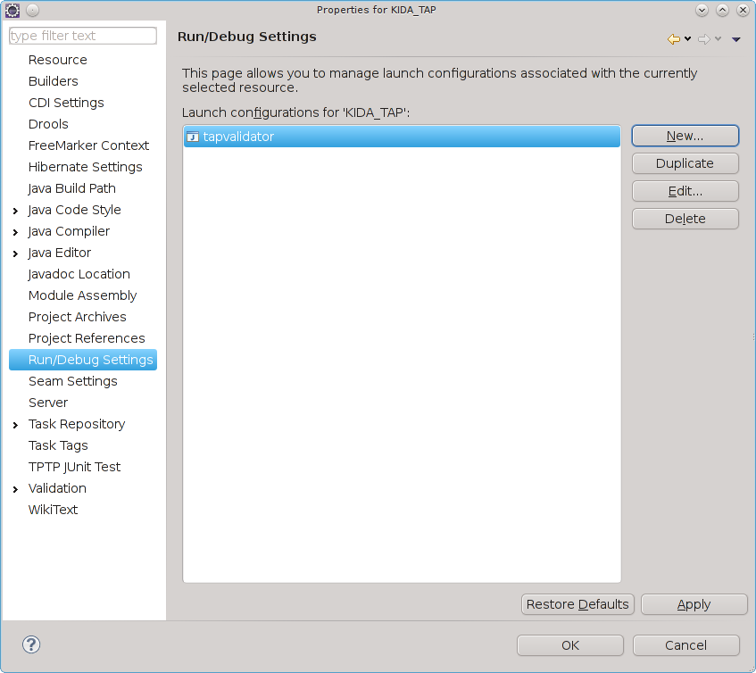
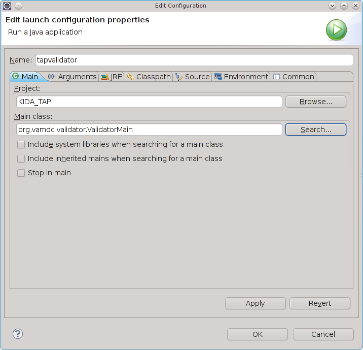

.. _plugintest:

Database plugin testing
===========================

VAMDC-TAP Validator software may be used to test the database plugin operation,
so there is no need to install the web server and deploy web service framework on the development machine.
It comes with all the needed libraries bundled, and from the plugin point of view the operation 
with the VAMDC-TAP Validator is undistinguishable from the real-world operation.

To use VAMDC-TAP Validator for the plugin development, simply add the most recent VAMDC-TAP Validator jar file 
to the library path and create the new run configuration, 
indicating the **org.vamdc.validator.ValidatorMain** as the main class.

During the first run, open the Settings dialog, switch to the plugin mode
and configure the Plugin class name to contain the fully-qualified name 
of your class implementing the :ref:`DatabasePlug` interface.

If everything is set up correctly, you should be able to see the list of supported restrictables
in the right-top text area and be able to do the queries.

For more information on the VAMDC-TAP Validator user interface and features, consult the [TAPValidator]_ documentation.

Screenshots
----------------

In case you are using the Eclipse for development, the following screenshots might help.
Open the project properties of your database plugin.

.. _buildpath:

Adding VAMDC-TAP Validator to the build path
+++++++++++++++++++++++++++++++++++++++

Add the latest VAMDC-TAP Validator JAR to the build path, clicking on the "Add external JARs" button

.. _runconfs:

Managing run configurations
+++++++++++++++++++++++++++++

Setup a new run configuration by clicking the "New..." button

.. _newrunconf:

Creating run configuration
+++++++++++++++++++++++++++++

Create the new run configuration with the following Main class path

Maven Integration
--------------------

All Java software developed as a part of VAMDC is available at VAMDC Maven repository

http://dev.vamdc.org/nexus/content/repositories/releases/

To use Maven for dependency management of your plugin, a following sample POM.xml may be used::

	<project xmlns="http://maven.apache.org/POM/4.0.0"
		xmlns:xsi="http://www.w3.org/2001/XMLSchema-instance"
		xsi:schemaLocation="http://maven.apache.org/POM/4.0.0 
			http://maven.apache.org/xsd/maven-4.0.0.xsd">
		<modelVersion>4.0.0</modelVersion>
		<groupId>org.vamdc.%databasename%</groupId>
		<artifactId>plugin</artifactId>
		<name>databasename plugin for java node software</name>

		<parent>
			<groupId>org.vamdc.tap</groupId>
			<artifactId>vamdctap-plugin</artifactId>
			<version>12.07</version>
		</parent>

		<distributionManagement>
			<repository>
				<id>releases</id>
				<url>http://dev.vamdc.org/nexus/content/repositories/releases</url>
			</repository>
		</distributionManagement>

		<dependencies>
			<dependency>
				<groupId>org.vamdc.%databasename%</groupId>
				<artifactId>database_dao</artifactId>
				<version>0.0.1-SNAPSHOT</version>
			</dependency>
			<dependency>
				<groupId>commons-collections</groupId>
				<artifactId>commons-collections</artifactId>
				<version>3.2.1</version>
			</dependency>
		</dependencies>
	</project>

All the required common dependencies are described within *parent* pom, **vamdctap-plugin**

